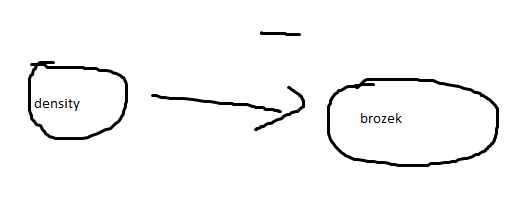

```{r setup, include=FALSE, message=FALSE}
library(faraway)
library(tidyverse)
library(rethinking)
library(tidybayes)
library(rethinking)
library(ggformula)
library(bayesplot)
library(mosaic)
knitr::opts_chunk$set(echo = TRUE)
```

```{r}
library(faraway)
# head(fat)
# for more info, type in the R console:
# ?fat
```

## Instructions

Choose one or more of the options below to practice linear regression. Save your group's work in an Rmd file (that you may later present to the class). The process:

-   Choose a response variable and a single main predictor. Have a rationale for your choices (even if it's not written down in detail).

    > main predictor: `density`
    >
    > response: `brozek`

-   Sketch (by pencil or using `dagitty`) a **causal diagram** for this situation. You may want to include other variables from the dataset, or even ones that you *don't* have data on. By using just one predictor and the response, what other key covariates might you be ignoring (if any)?



-   Write out a **description of a model** including your predictor and response variables (only). Use a normal distribution to model your response (your choice of distribution(s) for priors). If needed, use internet research to get background and select priors.

    > $$\text{brozek_i} \sim \text{Normal}(\mu_i, \sigma^2)$$ $$\mu_i \sim \beta_0 + \beta_1 * \text{density_i}$$ $$\beta_0 \sim \text{Normal}(0, 10)$$ $$\beta_1 \sim \text{Normal}(0, 10)$$ $$\sigma \sim \text{Uniform}(0, 10)$$

-   Now you can peek at the data...consider making a scatter plot of the response vs the predictor. (`gf_point(response ~ predictor, data = dataset_name)` will do it for you.)

    ```{r}
    gf_point(brozek ~ density, data = fat)
    ```

-   Do a **prior predictive check** (generate a prior predictive distribution as a reality check for your priors.

    ```{r}
    n_samples <- 10000

    beta_0_prior <- rnorm(n_samples, mean = 0, sd = 10)
    beta_1_prior <- rnorm(n_samples, mean = 0, sd = 10)
    sigma_prior <- runif(n_samples, min = 0, max = 10)

    density_values <- runif(n_samples, min = 0.9, max = 1.2)

    brozek_prior <- rnorm(n_samples, 
                          mean = beta_0_prior + beta_1_prior * density_values, 
                          sd = sigma_prior)

    gf_histogram(~brozek_prior, binwidth = 1)
    ```

-   Use `quap()` to fit your model.

```{r}
brozek_density_model <- quap(
  alist(
    brozek ~ dnorm(mu, sigma),
    mu <- beta_0 + beta_1 * density,
    beta_0 ~ dnorm(0, 10),
    beta_1 ~ dnorm(0, 10),
    sigma ~ dunif(0, 10)
  ),
  data = fat
)

precis(brozek_density_model)
```

```{r}
plot(precis(brozek_density_model))
```

-   Think about how you might graph your **posterior distributions.** You can at least make a density plot or two. But...what do those mean? Are they easy to interpret? What is *really* most relevant to show? Consider carefully and sketch what you'd *want* to show. If you are bold and confident with your R skills, you can consider also making the graphs you envision. (Stay tuned for Wednesday.)

```{r, message = FALSE, warning = FALSE}
brozek_density_posterior_samples <- extract.samples(brozek_density_model, n = 1000)
# beta_0 shows the estimated base body fat percentage when density is zero.
gf_dens(~beta_0, data = brozek_density_posterior_samples) 

# beta_1 shows how much the body fat percentage changes with each unit change in density.
gf_dens(~beta_1, data = brozek_density_posterior_samples)

# sigma shows the estimated variability in body fat percentage not explained by density.
gf_dens(~sigma, data = brozek_density_posterior_samples) 
```

-   Maybe, for extra challenge: Generate and graph a **posterior predictive distribution**, comparing it with your observed data.

```{r}
# Generate posterior predictive distribution
posterior_ppred <- brozek_density_posterior_samples |>
  # add row numbers to "label" each sampled of beta_0, beta_1, and sigma
  mutate(row_num = c(1:n())) |>
  # work one row (one beta_0, beta_1, sigma combination) at a time
  rowwise() |>
  # simulate a dataset for each row (= each beta_0, beta_1, sigma combo)
  mutate(
    ppred = list(rnorm(nrow(fat),
                        mean = beta_0 + beta_1 * fat$density,
                        sd = sigma))
  ) |>
  select(row_num, ppred) |>
  unnest(cols = ppred)

# Peek at the final result
glimpse(posterior_ppred)
```

```{r}
gf_dens(~ppred, group = ~row_num,
        data = posterior_ppred, 
        alpha = 0.1) |>
  gf_dens(~brozek, 
          data = fat, 
          inherit = FALSE, 
          color = 'darkorange', 
          linewidth = 1.5)
```

-   Considering all you have done...what can you conclude?

    > The posterior predictive distribution line up with the actual data, nice.
    >
    > The fat percentage is around 20% given the density in the dataset.
